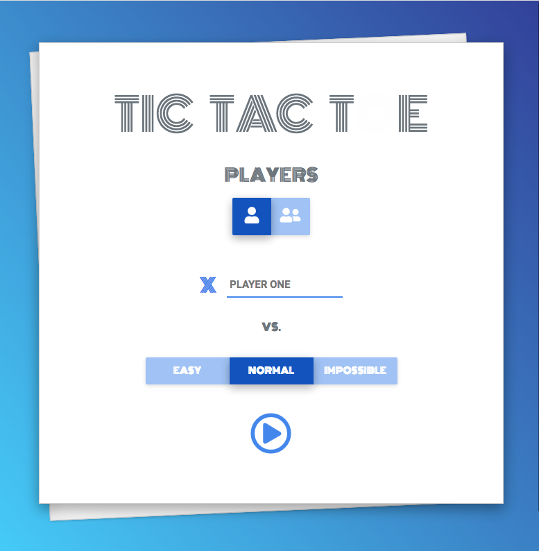
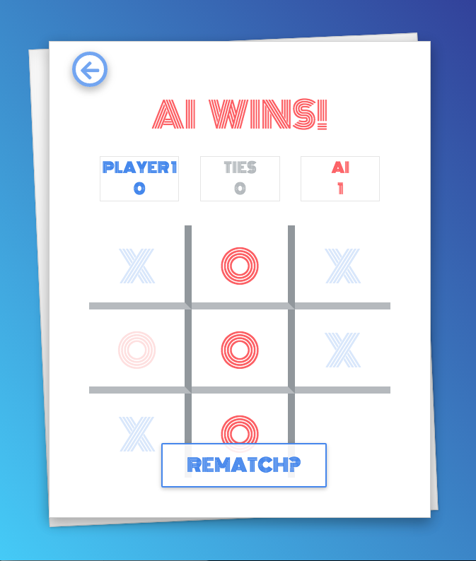

# Tic Tac Toe Game

> **Home page**
# 

This project was completed for The Odin Project JavaScript Tic Tac Toe Assignment. 

This is created using plain JavaScript. 

The aim of the project was to create an interative web game that used factory functions and the module pattern. 

This is a complete and fully functional WebApp game and optimized for certain mobile screens. The game was designed with a level of AI for one player mode. 

**_Artificial Intelligence_**
There are three differnt levels to choose from, that through AI create a differnt level of difficulty. 

**EASY:** This level randomly selects an empty space to place the move.

**NORMAL**: This level thinks just about the current move, it loops through the possible win lines and evaluates the "X" & "O" if the AI can win it will, if the human can win it will block, otherwise it will contiue to place on a line in which it current already has made a move. 

**IMPOSSIBLE**: This level I used the [Mini-Max](https://www.javatpoint.com/mini-max-algorithm-in-ai) algorithm, a recursive or backtracking algorithm which is used in decision-making and game theory.

To see the full list of the project outlines along with other submission visit the assignment page [The Odin Project: JavaScript Tic Tac Toe](https://www.theodinproject.com/courses/javascript/lessons/tic-tac-toe-javascript?ref=lnav)

>**Game page**
# 

## Table of contents

1. [Demo](#demo)
2. [Technologies](#technologies)
3. [Features](#features)
4. [Development](#development)
5. [License](#license)

## Demo

Here is the working live demo:
[https://benjamin-gambling.github.io/tic-tac-toe/](https://benjamin-gambling.github.io/tic-tac-toe/).

## Technologies

- Javascript modules, ES6, Bootstrap, MDB
- [Bootstrap](https://getbootstrap.com/)
- [MDB](https://mdbootstrap.com/)

  
  

## Features
- One Player with easy, normal and impossible difficulity
- Two Player 
- Fun Animations with interative elements 
- Deveoped for certain mobiles 
- Fun design
- Designed for anyone to enjoy 

### Devlopment
- Make more mobile user friendly/Make mobile app
- Improve Normal mode 

## License

> You can check out the full license [here](LICENSE)

This project is licensed under the terms of the **MIT** license.